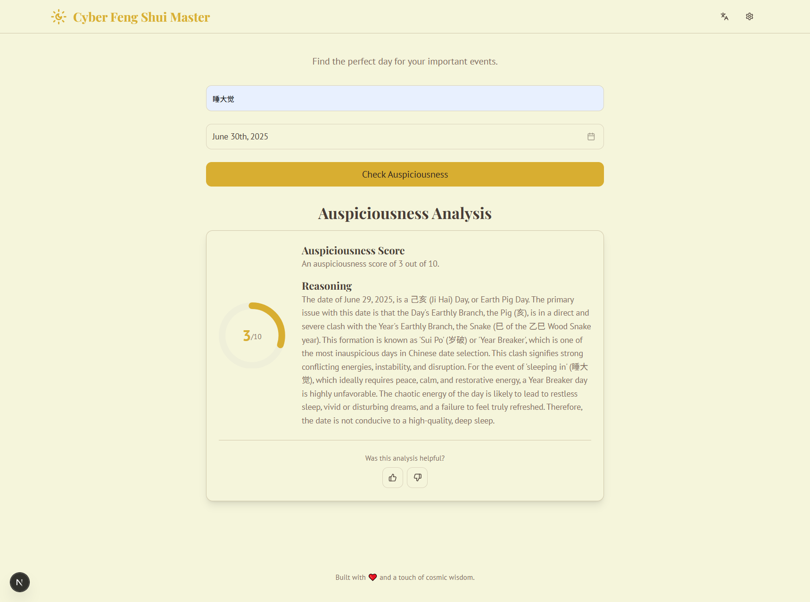

# Cyber Feng Shui Master

A modern web application that combines traditional Feng Shui wisdom with the power of AI to help you find auspicious dates for your important life events.

## ✨ Features

- **AI-Powered Analysis**: Get an auspiciousness score (1-10) and detailed reasoning for any event and date.
- **Modern UI**: Sleek, responsive, and user-friendly interface built with the latest web technologies.
- **Multi-Language Support**: Fully localized in both English and Chinese (中文).
- **Customizable**: Configure your own Google AI API key and choose the Gemini model you want to use.
- **Personalization**: Includes fields for gender and birth date to allow for future personalized readings.

## 🛠️ Tech Stack

- **Framework**: Next.js (App Router)
- **Language**: TypeScript
- **AI Integration**: Genkit (with Google's Gemini models)
- **Styling**: Tailwind CSS
- **UI Components**: shadcn/ui

## 🚀 Getting Started

Follow these steps to get the Cyber Feng Shui Master application running on your local machine.

### Prerequisites

- **Node.js**: Version 18 or later is recommended.
- **npm** (or yarn/pnpm): Comes bundled with Node.js.
- **Google AI API Key**: You'll need a free API key from Google to use the AI features. You can get one from [Google AI Studio](https://aistudio.google.com/app/apikey).

### Launch Guide

1.  **Install Dependencies**:
    Open your terminal in the project's root directory and run the following command to install all the necessary packages:
    ```bash
    npm install
    ```

2.  **Run the Development Server**:
    Once the installation is complete, start the Next.js development server:
    ```bash
    npm run dev
    ```
    The application will now be running, typically at `http://localhost:9002`.

3.  **Configure the Application**:
    The AI features will not work without a valid API key.
    - Open `http://localhost:9002` in your browser.
    - Click the **Settings** icon (⚙️) in the top-right corner.
    - Paste your **Google AI API Key** into the designated field.
    - Optionally, you can specify a different compatible Gemini model name.
    - Click **Save**. Your settings are stored securely in your browser's local storage.

## 💡 Usage

With the application running and configured:

1.  Describe the event you are planning (e.g., "Wedding", "Moving to a new house").
2.  Use the calendar to select a date.
3.  Click the **"Check Auspiciousness"** button.
4.  The AI will analyze the date and provide you with a score and a detailed explanation based on Feng Shui principles.

## Preview


## Acknowledgements
This project is built with Firebase Studio with support from Google AI Sprint 2025.